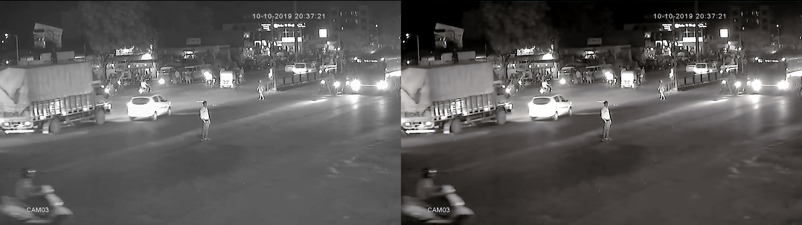
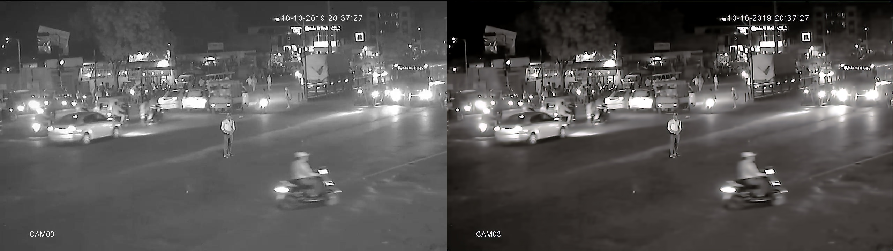
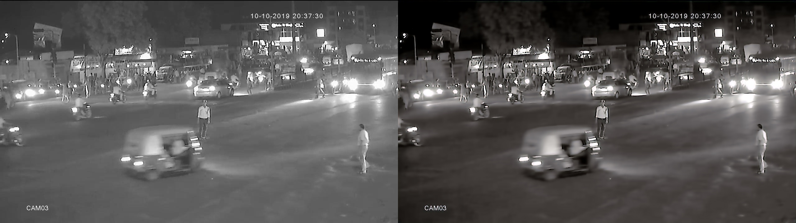
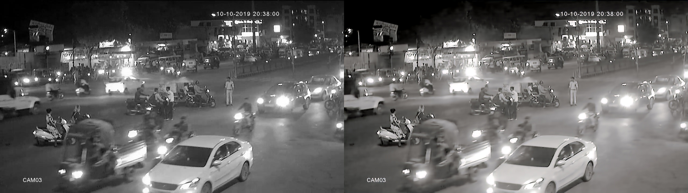
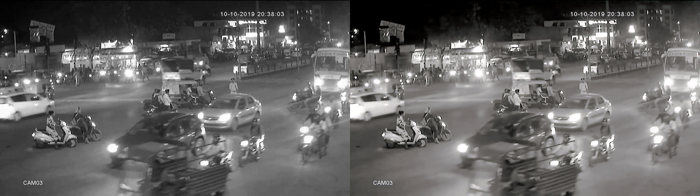
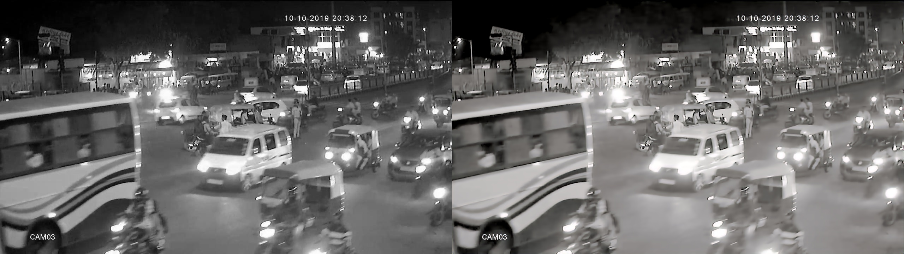
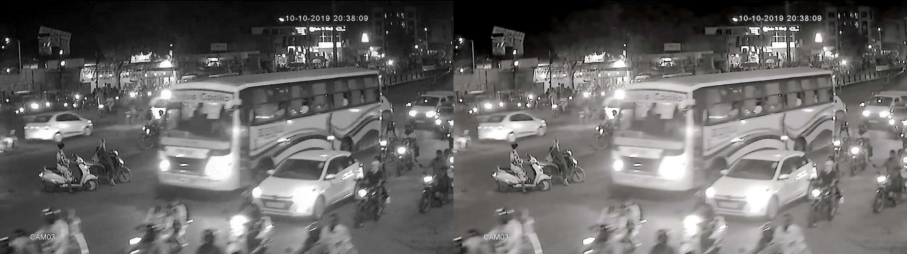

@Priyansh Kedia
Some Important Points I concluded:
1.	Researchers have dealt separately with night time (low-light and Dark) and day time images.
2.	All the pretrained DL models for the night time were trained on colored RGB images not on Greyscale.
3.	It would be more beneficial if we work on RGB Images for Night Time, and train 2 different models for Day and Night Time.
4.	Most of the models, whose research code are available on GitHub are implemented on TensorFlow 1.x, and though we know abut the model architecture we won’t be able to train them as we don’t have that kind of training data.
 
 Some Examples from the Resuls Folder

 Left One: Input Image from Our Dataset

 Right one: Processed Image from this Model
 
 
 
 
 
 
 
 
 
 
