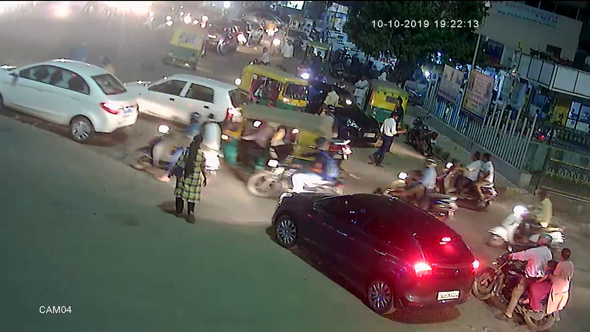
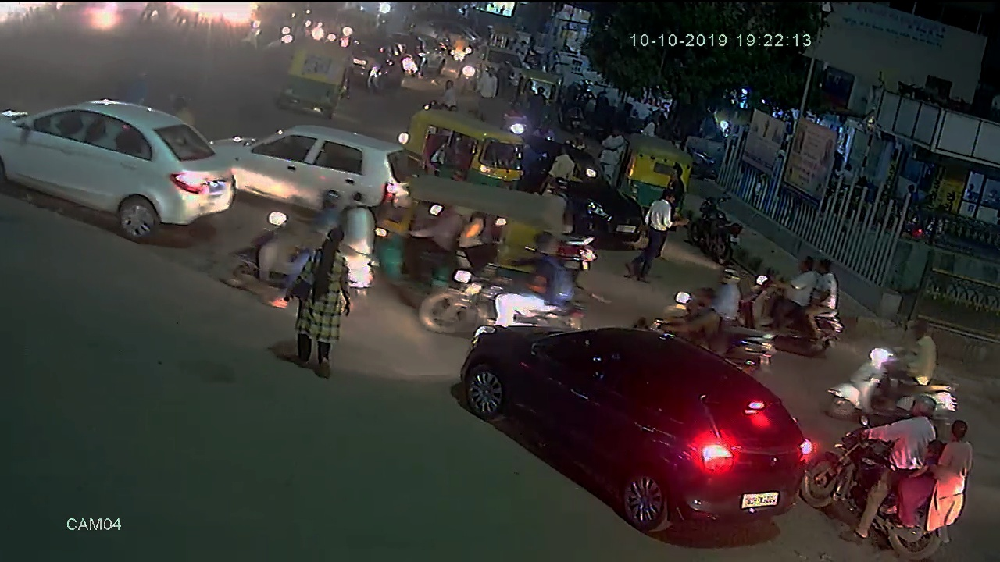
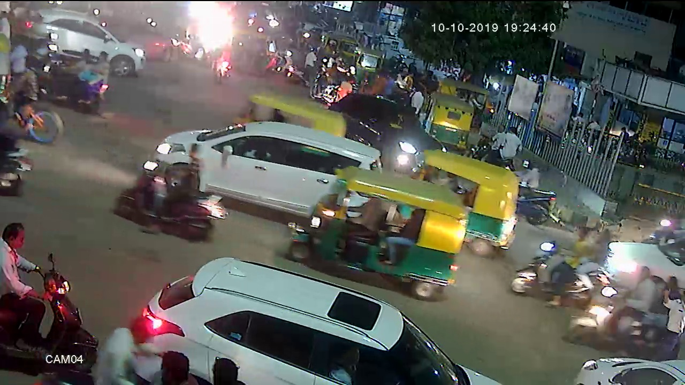
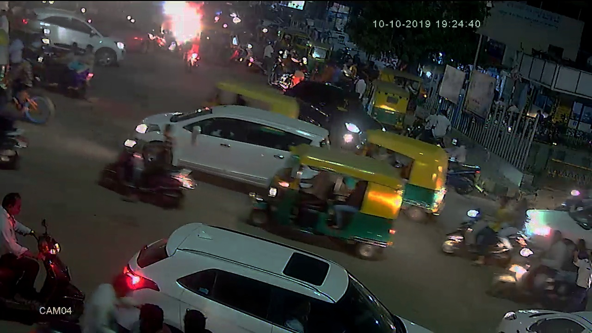

## Reduce-glare-filter
```
python generate.py
```

4-filters by step:

1. f(x) = 1.657766x - 0.009157128x^2 + 0.00002579473x^3
2. Gamma correction: g = 0.6
3. f(x) = -4.263256e^-14 + 1.546429x - 0.005558036x^2 + 0.00001339286x^3
4. Gamma correction: g = 0.9

### Results






Results from 001 folder in Generated_images
